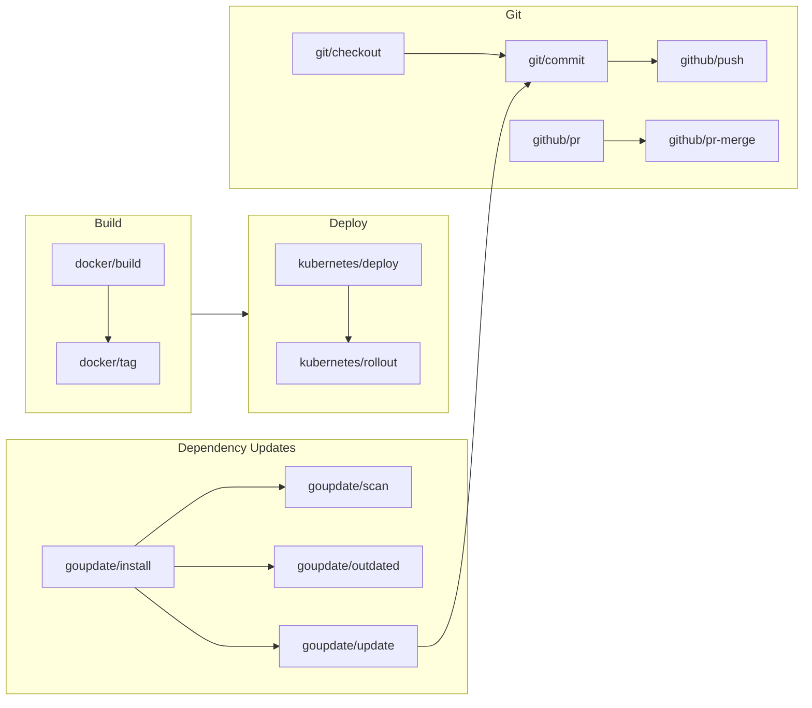
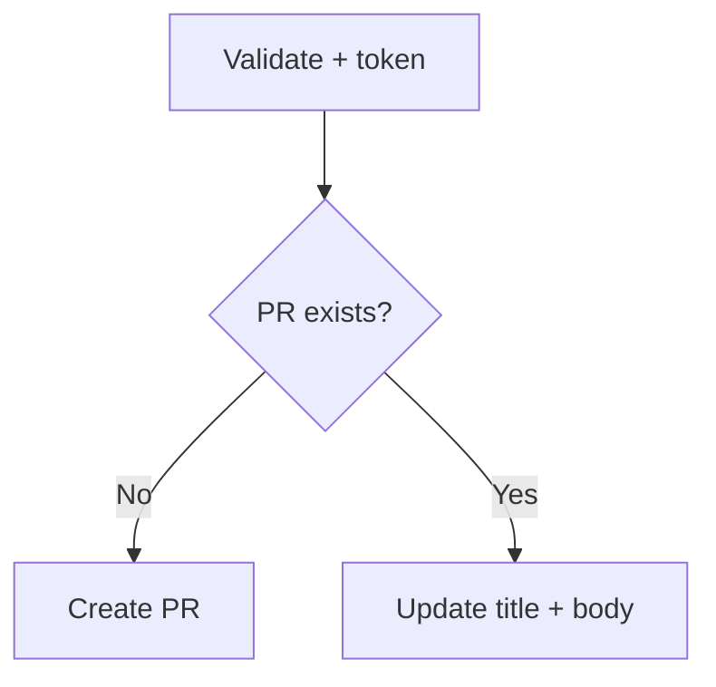
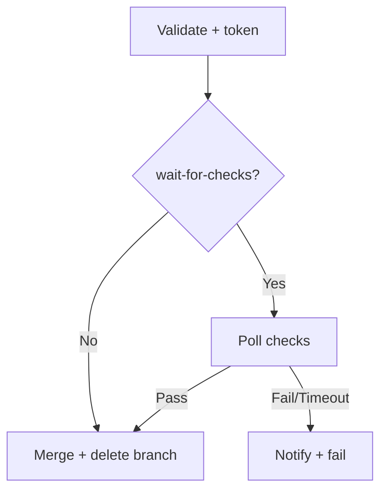
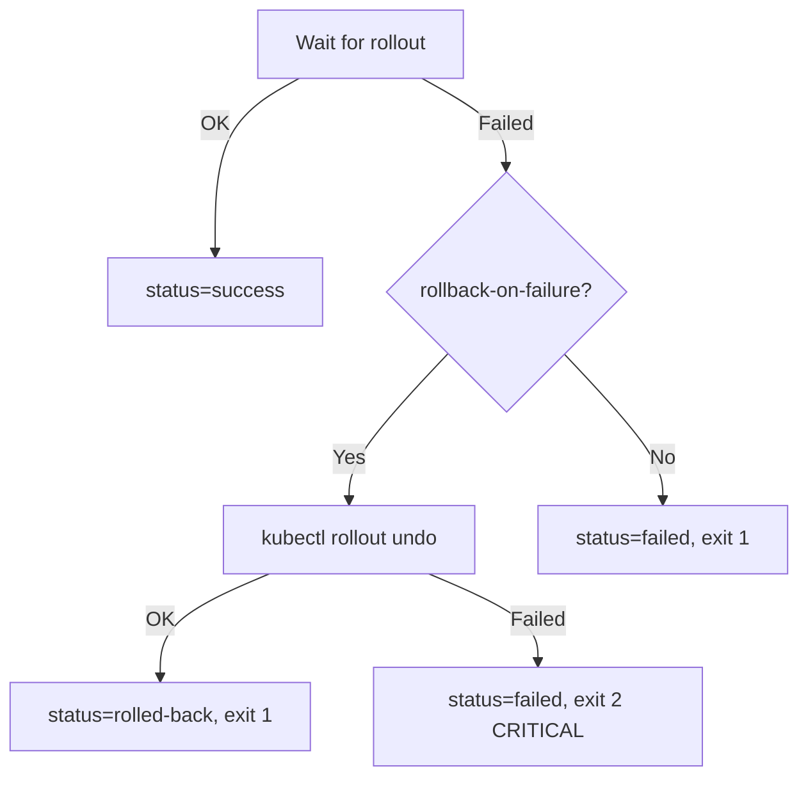

# DIT GitHub Actions

Shared composite actions for CI/CD at [Utdanningsdirektoratet](https://github.com/Utdanningsdirektoratet) DIT.

```
- uses: Utdanningsdirektoratet/dit-github-actions/{action}@v1
```

| Action | Purpose |
|--------|---------|
| [`docker/build`](#dockerbuild) | Build & push image with registry caching |
| [`docker/tag`](#dockertag) | Tag image by digest (parallel) |
| [`git/checkout`](#gitcheckout) | Create or checkout branch from source |
| [`git/commit`](#gitcommit) | Stage and commit all changes |
| [`github/pr`](#githubpr) | Create or find a pull request |
| [`github/pr-merge`](#githubpr-merge) | Wait for checks and merge a PR |
| [`github/push`](#githubpush) | Push with GitHub App or token |
| [`github/runtimes`](#githubruntimes) | Setup Node/Python/Go/PHP/.NET |
| [`goupdate/*`](#goupdate) | Dependency scanning & updates |
| [`js/install`](#jsinstall) | Install & cache Node.js deps |
| [`js/playwright`](#jsplaywright) | Playwright browser setup with caching |
| [`kubernetes/deploy`](#kubernetesdeploy) | Set image on deployment |
| [`kubernetes/rollout`](#kubernetesrollout) | Wait for rollout + auto-rollback |

## Architecture



## Examples

<details>
<summary><b>Build, Tag, Deploy</b></summary>

```yaml
jobs:
  build:
    runs-on: ubuntu-latest
    outputs:
      digest: ${{ steps.build.outputs.digest }}
    steps:
      - uses: actions/checkout@v4
      - id: build
        uses: Utdanningsdirektoratet/dit-github-actions/docker/build@v1
        with:
          registry: registry.example.com
          username: ${{ secrets.REG_USER }}
          password: ${{ secrets.REG_PASS }}
          image: myapp
          push-by-digest: "true"

  deploy:
    needs: build
    runs-on: ubuntu-latest
    steps:
      - id: tag
        uses: Utdanningsdirektoratet/dit-github-actions/docker/tag@v1
        with:
          registry: registry.example.com
          username: ${{ secrets.REG_USER }}
          password: ${{ secrets.REG_PASS }}
          image: myapp
          digest: ${{ needs.build.outputs.digest }}
          tag-latest: latest-production

      - uses: Utdanningsdirektoratet/dit-github-actions/kubernetes/deploy@v1
        with:
          kube-config: ${{ secrets.KUBECONFIG }}
          namespace: production
          deployment: myapp
          image: ${{ steps.tag.outputs.image-ref }}

      - uses: Utdanningsdirektoratet/dit-github-actions/kubernetes/rollout@v1
        with:
          kube-config: ${{ secrets.KUBECONFIG }}
          namespace: production
          deployment: myapp
```

</details>

<details>
<summary><b>Automated dependency updates</b></summary>

```yaml
name: Dependency Updates
on:
  schedule:
    - cron: "0 6 * * 1"

jobs:
  update:
    runs-on: ubuntu-latest
    steps:
      - uses: actions/checkout@v4
        with:
          fetch-depth: 0
      - uses: Utdanningsdirektoratet/dit-github-actions/goupdate/install@v1

      - uses: Utdanningsdirektoratet/dit-github-actions/git/checkout@v1
        id: branch
        with:
          branch: goupdate/auto-update-minor
          source-branch: main

      - id: update
        uses: Utdanningsdirektoratet/dit-github-actions/goupdate/update@v1
        with:
          update-type: minor

      - if: steps.update.outputs.has-changes == 'true'
        uses: Utdanningsdirektoratet/dit-github-actions/git/commit@v1
        with:
          message: "GoUpdate: minor update ({date})"

      - if: steps.update.outputs.has-changes == 'true'
        uses: Utdanningsdirektoratet/dit-github-actions/github/push@v1
        with:
          app-id: ${{ secrets.APP_ID }}
          app-private-key: ${{ secrets.APP_KEY }}
          branch: ${{ steps.branch.outputs.branch-name }}

      - if: steps.update.outputs.has-changes == 'true'
        id: pr
        uses: Utdanningsdirektoratet/dit-github-actions/github/pr@v1
        with:
          app-id: ${{ secrets.APP_ID }}
          app-private-key: ${{ secrets.APP_KEY }}
          title: "GoUpdate: minor update ({date})"
          base: main
          head: ${{ steps.branch.outputs.branch-name }}

      - if: steps.update.outputs.has-changes == 'true'
        uses: Utdanningsdirektoratet/dit-github-actions/github/pr-merge@v1
        with:
          app-id: ${{ secrets.APP_ID }}
          app-private-key: ${{ secrets.APP_KEY }}
          pr-number: ${{ steps.pr.outputs.pr-number }}
          wait-for-checks: "600"
```

</details>

<details>
<summary><b>E2E tests with Playwright</b></summary>

```yaml
name: E2E Tests
on: [pull_request]
jobs:
  e2e:
    runs-on: ubuntu-latest
    steps:
      - uses: actions/checkout@v4
      - uses: Utdanningsdirektoratet/dit-github-actions/github/runtimes@v1
        with:
          node-version: "22"
          node-pms: "pnpm"
      - uses: Utdanningsdirektoratet/dit-github-actions/js/install@v1
      - uses: Utdanningsdirektoratet/dit-github-actions/js/playwright@v1
        with:
          browsers: "chromium"
      - run: pnpm test:e2e
```

</details>

---

## Action Reference

### `docker/build`

Build and push a Docker image with registry-based layer caching. Supports tagged pushes and digest-only pushes for multi-environment workflows.

> [!TIP]
> Use `push-by-digest: "true"` when the same build should be tagged differently per environment, then follow up with `docker/tag`.

<details>
<summary>Inputs / Outputs</summary>

**Inputs**

| Input | Required | Default | Description |
|-------|:--------:|---------|-------------|
| `registry` | yes | | Registry host |
| `username` | yes | | Registry username |
| `password` | yes | | Registry password/token |
| `image` | yes | | Image name (no registry prefix) |
| `tag` | | `""` | Version tag |
| `tag-latest` | | `latest` | Rolling environment tag |
| `push-by-digest` | | `false` | Push by digest only |
| `context` | | `.` | Build context path |
| `dockerfile` | | `{context}/Dockerfile` | Dockerfile path |
| `platforms` | | `linux/amd64` | Target platforms |
| `build-args` | | `""` | Multiline `KEY=VALUE` |

**Outputs:** `digest`, `image-ref`

</details>

<details>
<summary>Caching strategy</summary>

Uses two registry-based cache sources: a dedicated `buildcache` tag with `mode=max` (all layers), and the rolling `tag-latest` as fallback. This ensures fast hits even when the dedicated cache is evicted.

</details>

---

### `docker/tag`

Tag an existing image by digest. Runs operations in parallel — creates version tag, short SHA tag, and rolling latest simultaneously.

<details>
<summary>Inputs / Outputs</summary>

**Inputs**

| Input | Required | Default | Description |
|-------|:--------:|---------|-------------|
| `registry` | yes | | Registry host |
| `username` | yes | | Registry username |
| `password` | yes | | Registry password |
| `image` | yes | | Image name |
| `digest` | yes | | Digest to tag (`sha256:...`) |
| `tag` | | auto | Version tag (auto: `YYMMDD-HHMMSS_<sha>`) |
| `tag-latest` | | `latest` | Rolling environment tag |

**Outputs:** `tag`, `image-ref`

</details>

---

### `git/checkout`

Create or checkout an existing branch from a source branch. If the branch exists, optionally fast-forward merge from source.

**Template variables** — the `branch` input supports: `{date}` (YYYY-MM-DD).

```yaml
# Input
branch: "updates/{date}"
# Resolved → updates/2026-02-11
```

<details>
<summary>Inputs / Outputs</summary>

**Inputs**

| Input | Required | Default | Description |
|-------|:--------:|---------|-------------|
| `branch` | yes | | Branch name (template variables: `{date}`) |
| `source-branch` | yes | | Source branch to create from or ff-merge |
| `auto-ff` | | `true` | Fast-forward merge from source on existing branches |
| `create-branch` | | `true` | Create branch from source if it does not exist |

**Outputs:** `branch-name` (resolved), `branch-exists`, `diverged`

</details>

---

### `git/commit`

Stage and commit all changes.

**Template variables** — the `message` input supports: `{date}` (YYYY-MM-DD), `{branch}` (current branch).

```yaml
# Input
message: "GoUpdate: minor update ({date}) on {branch}"
# Resolved → GoUpdate: minor update (2026-02-11) on goupdate/auto-update-minor
```

<details>
<summary>Inputs / Outputs</summary>

**Inputs**

| Input | Required | Default | Description |
|-------|:--------:|---------|-------------|
| `message` | | `GoUpdate: Update` | Commit message (template variables: `{date}`, `{branch}`) |
| `git-user-name` | | `github-actions[bot]` | Commit author name |
| `git-user-email` | | `...@users.noreply.github.com` | Commit author email |

**Outputs:** `has-changes`

</details>

---

### `github/pr`

Create, find, or update a pull request. If a PR already exists for the same head/base, its title and body are updated with resolved template variables. Accepts GitHub App or token for authentication.

**Template variables** — the `title` and `body` inputs support: `{date}` (YYYY-MM-DD), `{base}` (base branch), `{head}` (head branch).

```yaml
# Input
title: "GoUpdate: minor update ({date})"
body: "Merging `{head}` into `{base}`"
# Resolved → GoUpdate: minor update (2026-02-11)
# Resolved → Merging `goupdate/auto-update-minor` into `main`
```



<details>
<summary>Inputs / Outputs</summary>

**Inputs**

| Input | Required | Default | Description |
|-------|:--------:|---------|-------------|
| `app-id` | | `""` | GitHub App ID |
| `app-private-key` | | `""` | GitHub App private key |
| `github-token` | | `""` | Fallback token |
| `title` | yes | | PR title (template variables: `{date}`, `{base}`, `{head}`) |
| `body` | | `""` | PR body (template variables: `{date}`, `{base}`, `{head}`) |
| `base` | yes | | Base branch |
| `head` | yes | | Head branch |

**Outputs:** `pr-number`, `pr-url`, `created`

</details>

<details>
<summary>Authentication</summary>

Provide either `app-id` + `app-private-key` (GitHub App) **or** `github-token`. GitHub App is recommended when the PR needs to trigger workflows or merge through branch protection.

</details>

---

### `github/pr-merge`

Wait for checks and merge a pull request. Separated from `github/pr` for composability — use independently or chain after PR creation.



<details>
<summary>Inputs / Outputs</summary>

**Inputs**

| Input | Required | Default | Description |
|-------|:--------:|---------|-------------|
| `app-id` | | `""` | GitHub App ID |
| `app-private-key` | | `""` | GitHub App private key |
| `github-token` | | `""` | Fallback token |
| `pr-number` | yes | | PR number to merge |
| `merge-method` | | `squash` | `squash` / `merge` / `rebase` |
| `wait-for-checks` | | `300` | Timeout seconds (0 = disable) |
| `check-interval` | | `15` | Poll interval seconds |
| `notify` | | `""` | Users/teams to ping on failure |

**Outputs:** `merged`, `checks-passed`

</details>

---

### `github/push`

Push commits with optional GitHub App token to trigger downstream workflows. Auto-detects auth method from provided credentials.

> [!IMPORTANT]
> Credentials are cleaned up in an `if: always()` step, even on failure.

<details>
<summary>Inputs / Outputs</summary>

**Inputs**

| Input | Required | Default | Description |
|-------|:--------:|---------|-------------|
| `app-id` | | `""` | GitHub App ID (triggers workflows) |
| `app-private-key` | | `""` | GitHub App private key |
| `github-token` | | `""` | Fallback token (no workflow trigger) |
| `branch` | yes | | Branch to push |

**Outputs:** `pushed`, `sha`

</details>

<details>
<summary>Authentication</summary>

Provide either `app-id` + `app-private-key` (GitHub App, triggers workflows) **or** `github-token` (no workflow trigger). The action auto-detects which to use based on the provided credentials.

</details>

---

### `github/runtimes`

Setup language runtimes. All inputs opt-in — only specified runtimes are installed.

```yaml
- uses: Utdanningsdirektoratet/dit-github-actions/github/runtimes@v1
  with:
    node-version: "22"
    node-pms: "pnpm"
    python-version: "3.12"
```

<details>
<summary>Inputs</summary>

| Input | Default | Description |
|-------|---------|-------------|
| `node-version` | `""` | Node.js version |
| `node-pms` | `""` | Package managers (`npm,yarn,pnpm`) |
| `php-version` | `""` | PHP version |
| `python-version` | `""` | Python version |
| `go-version` | `""` | Go version |
| `dotnet-version` | `""` | .NET version |

</details>

---

### `goupdate`

Suite of actions for [goupdate](https://github.com/ajxudir/goupdate) dependency management. Install first, then scan/outdated/update.

| Action | Purpose |
|--------|---------|
| `goupdate/install` | Install binary from GitHub releases |
| `goupdate/scan` | Detect package managers & lock files |
| `goupdate/outdated` | Check outdated deps with major/minor/patch breakdown |
| `goupdate/update` | Apply updates (**does not commit or push**) |

<details>
<summary>goupdate/install — Inputs / Outputs</summary>

| Input | Default | Description |
|-------|---------|-------------|
| `version` | `latest` | Version or tag |
| `repo` | `ajxudir/goupdate` | GitHub repo |
| `github-token` | `""` | Avoids API rate limits |

**Outputs:** `version`

</details>

<details>
<summary>goupdate/scan — Inputs / Outputs</summary>

**Inputs:** `working-directory` (default `.`)

**Outputs:** `package-managers`, `rules` (comma-separated)

</details>

<details>
<summary>goupdate/outdated — Inputs / Outputs</summary>

**Inputs:** `working-directory` (default `.`)

**Outputs:** `total`, `total-outdated`, `major`, `minor`, `patch`

</details>

<details>
<summary>goupdate/update — Inputs / Outputs</summary>

| Input | Default | Description |
|-------|---------|-------------|
| `update-type` | `minor` | `major` / `minor` / `patch` |

**Outputs:** `has-changes`, `partial-failure`

> [!NOTE]
> Uses `--continue-on-fail` so partial updates still produce changes. If all updates fail (no changes), the action fails. If some succeed, `partial-failure=true` lets the workflow create a PR without auto-merging. Use `git/checkout` and `git/commit` to handle branch setup and commits.

</details>

---

### `js/install`

Install and cache Node.js deps. Auto-detects PM from lock files: `pnpm-lock.yaml` > `yarn.lock` > `package-lock.json`.

> [!WARNING]
> Does **not** install Node.js. Use `github/runtimes` first.

<details>
<summary>Inputs / Outputs</summary>

| Input | Default | Description |
|-------|---------|-------------|
| `working-directory` | `.` | Directory with `package.json` |
| `package-manager` | auto | Force `npm` / `yarn` / `pnpm` |

**Outputs:** `package-manager`, `cache-hit`

</details>

---

### `js/playwright`

Install Playwright browsers with caching. Caches browser binaries by Playwright version for fast subsequent runs. Run tests in your workflow directly (e.g. `pnpm test:e2e`).

> [!WARNING]
> Requires Node.js and dependencies installed first. Use `github/runtimes` + `js/install` before this action.

```yaml
- uses: Utdanningsdirektoratet/dit-github-actions/js/playwright@v1
  with:
    browsers: "chromium"
- run: pnpm test:e2e
```

<details>
<summary>Inputs / Outputs</summary>

**Inputs**

| Input | Required | Default | Description |
|-------|:--------:|---------|-------------|
| `working-directory` | | `.` | Directory with Playwright |
| `browsers` | | `""` | Browsers to install (empty = all project browsers) |

**Outputs:** `playwright-version`, `cache-hit`

</details>

<details>
<summary>Caching strategy</summary>

Caches `~/.cache/ms-playwright` keyed by Playwright version and browser selection. When cache hits, only system dependencies are reinstalled (fast). When cache misses, full browser download + system deps are installed.

</details>

---

### `kubernetes/deploy`

Set image on a Kubernetes deployment. Kubeconfig uses `mktemp` with `if: always()` cleanup.

<details>
<summary>Inputs / Outputs</summary>

| Input | Required | Description |
|-------|:--------:|-------------|
| `kube-config` | yes | Base64-encoded kubeconfig |
| `namespace` | yes | Namespace |
| `deployment` | yes | Deployment name |
| `image` | yes | Full image reference |

**Outputs:** `status` (`success` / `failed`)

</details>

---

### `kubernetes/rollout`

Wait for rollout with optional auto-rollback on failure.



<details>
<summary>Inputs / Outputs</summary>

| Input | Required | Default | Description |
|-------|:--------:|---------|-------------|
| `kube-config` | yes | | Base64-encoded kubeconfig |
| `namespace` | yes | | Namespace |
| `deployment` | yes | | Deployment name |
| `timeout` | | `300` | Timeout seconds |
| `rollback-on-failure` | | `true` | Auto-rollback |

**Outputs:** `status` (`success` / `rolled-back` / `failed`)

</details>

---

## Security

<details>
<summary>Credential handling</summary>

- **Token masking** — `::add-mask::` before any use
- **Credential cleanup** — `if: always()` steps remove git headers
- **Temp files** — Kubeconfigs use `mktemp` + `trap`-based cleanup
- **No inline secrets** — All passed via `env:` blocks

</details>

<details>
<summary>GitHub App vs GITHUB_TOKEN</summary>

Use a GitHub App when pushes need to **trigger workflows**, PRs need to **merge through branch protection**, or you need a **distinct identity** for automated commits. `GITHUB_TOKEN` suffices for everything else.

All `github/*` actions auto-detect auth method: provide `app-id` + `app-private-key` for GitHub App, or `github-token` for default token.

</details>

## Versioning

| Ref | Use |
|-----|-----|
| `@v1` | **Recommended** — latest stable |
| `@v1.2.3` | Pinned for reproducibility |
| `@main` | Latest commit |

<details>
<summary>Release process</summary>

**Tag specific release:**
```bash
git tag v1.0.1 && git push origin v1.0.1
```

**Update rolling v1 tag:**
```bash
git tag -f v1 && git push -f origin v1
```

> [!NOTE]
> `v1` is a moving target (latest stable). Specific versions (`v1.0.1`) are immutable.

</details>
